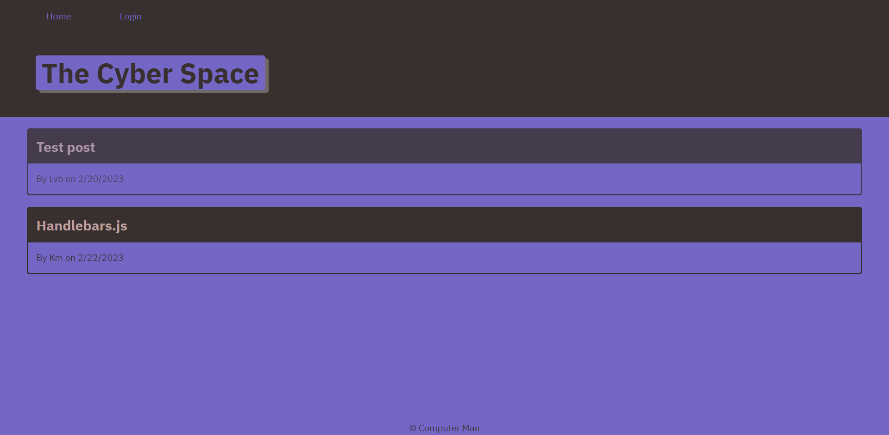

# The Cyber Space

## Description

My motivation to build this project was to create a tech blog where people can have discussions about tech and coding. In this project I learned how to use handle bars and built my first full-stack project. I wanted a nieche place where people could have a discussion on their favorite discussions.

## Installation

The following node programs must be installed if running from the terminal, bcrypt, dotenv, express, express-handlebars, express-session, mysql2, connect session sequelize and sequelize.

## Usage

In order to use this project, click on the create new poat button and enter the info you would like your post to be about. If you would like to comment, click on a post and enter your comment in the comment box below. If you would like to edit a post, click on your post and hit update or delete.

https://thecyberspace.herokuapp.com/

## Credits

N/A

## License

N/A
